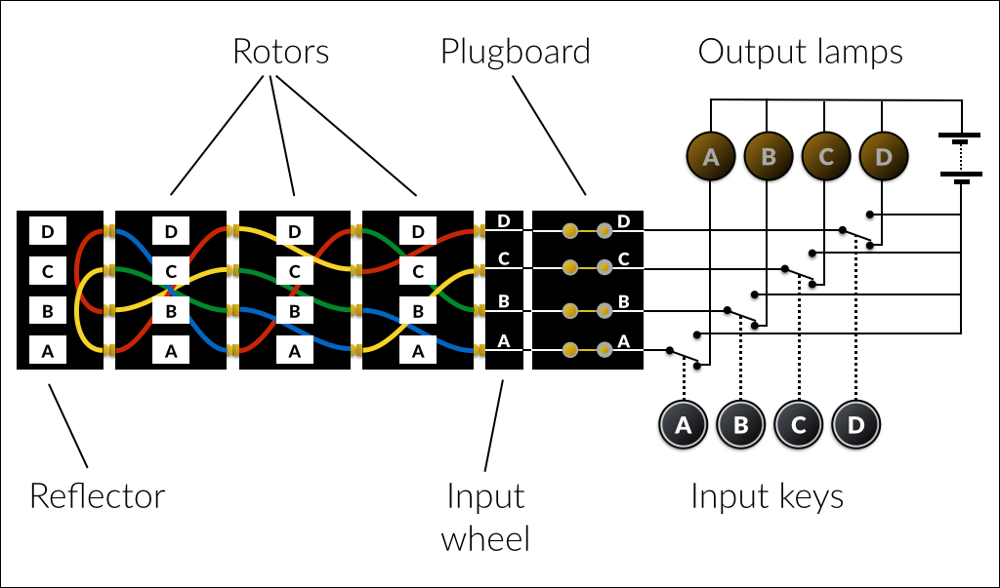
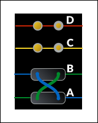
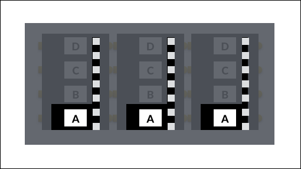
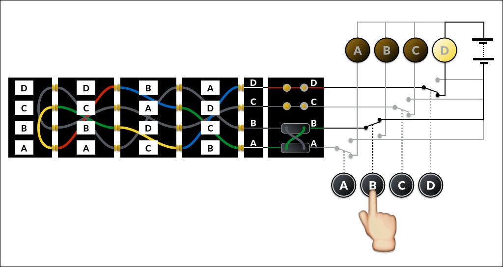
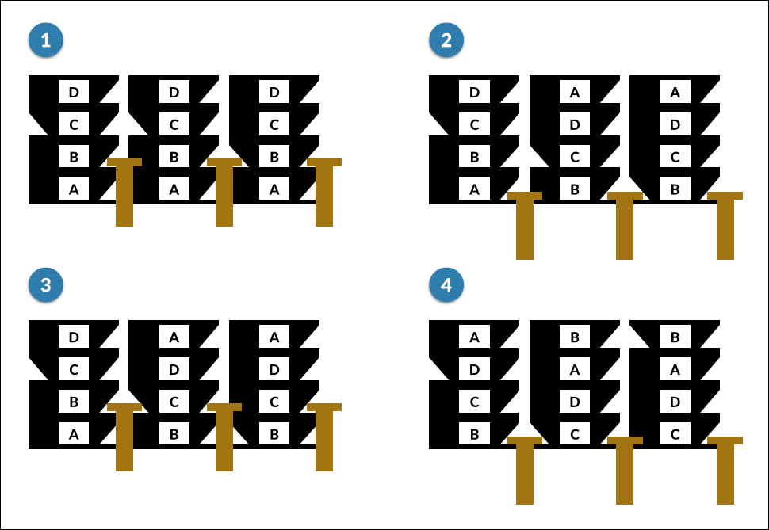
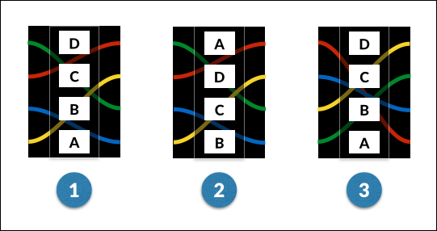

 
## Introduction

We run a weekly coding dojo at work, and I thought implementing an Enigma
machine simulator might make an interesting problem, so I spent a few evenings
reading up about how the machines worked. Unfortunately my attempt to explain
it all in a few minutes was &hellip; let's just say somewhat less than
successful. This is an attempt at a better explanation!

You can find my solution (in Ruby) in the [github
repo](https://github.com/kerryb/enigma) that this site is attached to.

If you want to read a bit more about the workings of a real Enigma machine,
here are my main sources of information:

* [Wikipedia](http://en.wikipedia.org/wiki/Enigma_machine)
* [Cryptomuseum](http://www.cryptomuseum.com/crypto/enigma/)
* [Universal Enigma simulator](http://people.physik.hu-berlin.de/~palloks/js/enigma/enigma-u_v20_en.html)

 "<a href="http://commons.wikimedia.org/wiki/File:EnigmaMachineLabeled.jpg#/media/File:EnigmaMachineLabeled.jpg">EnigmaMachineLabeled</a>". Licensed under Public Domain via <a href="//commons.wikimedia.org/wiki/">Wikimedia Commons</a>.

## The problem

Your task is to implment a simulator for the Enigma I (Army/Wehrmacht)
enycryption machine. Once you have this model simulated, it should be
relatively simple to expand it to other variants, such as those with more
rotors, multiple turnover notches or repositionable reflector wheels (don't
worry, those terms should make sense soon). While building your solution, keep
this expandability in mind &ndash; without prematurely generalising, does your
design separate the various concerns in such a way that new features should fit
in neatly?  

The program you write should take a string of plaintext, and return a string of
cyphertext (or vice versa &ndash; the encryption is symmetrical, so feeding the
cyphertext into a machine with the same initial settings as were used for
encryption will output the original text).

## So how does it work?

To simplify things, we're going to show a machine that only has an alphabet of
four letters (the real one has 26, as should your simulation). Also, in the
diagrams below, the rotors have been "unrolled" &ndash; imagine that the top of
each rotor joins up with the bottom to form a circle.

### Components

This diagram illustrates the six main components of the machine:

#### Input keys

This is where the text to be encrypted is entered, one letter at a time. The
switches and electrical circuit are shown for completeness, but for the
simulation you only need to treat it as a letter going in a different one
coming out. Interestingly, because of the way the signal is reflected up and
down the machine, it _is_ always a different letter &ndash; a letter is never
encrypted to itself. This was one of the flaws that made the cypher easier to
break.

#### Plugboard

This was an addition to the original Enigma design for the army version. It has
a pair of sockets for each letter, which by default are simply connected
together, so each of the 26 outputs lines up with its corresponding input.
However, the machine came with a number of patch cables, with a double plug on
each end. When inserted between the socket pairs for two letters, the default
connection is broken and the two letters are swapped. For example, here a cable
has been connected between A and B:

With this configuration, if the operator typed an A, then it would arrive in
the main part of the machine as a B (and vice versa). Because of the
back-and-forth nature of the machine, any patch cabless on the plugboard also
swap the connection to the output lamps.  

Up to 13 patch cables (or none) could be used at once, but the German army
procedures generally used ten.

You may want to ignore the plugboard to begin with, and add it once you have
the basic rotor system working.

#### Input wheel

This simply connects the plugboard outputs to a ring of 26 contacts which
correspond to the contacts on the rotors. The Enigma I simply mapped A to the
first position, B to the second and so on, although some other models used
German keyboard order (QWERTZU), and a few used other mappings.

You may choose not to model the input wheel at all &ndash; it's up to you.

#### Rotors

 "<a href="http://commons.wikimedia.org/wiki/File:Enigma_rotors_with_alphabet_rings.jpg#/media/File:Enigma_rotors_with_alphabet_rings.jpg">Enigma rotors with alphabet rings</a>" by <a href="//commons.wikimedia.org/w/index.php?title=User:TedColes&amp;action=edit&amp;redlink=1" class="new" title="User:TedColes (page does not exist)">TedColes</a> - Own work. Licensed under <a href="http://creativecommons.org/publicdomain/zero/1.0/deed.en" title="Creative Commons Zero, Public Domain Dedication">CC0</a> via <a href="//commons.wikimedia.org/wiki/">Wikimedia Commons</a>.

These, unsurprisingly, form the heart of the Enigma algorithm. The Enigma I,
like most variants, used three rotors.

Each rotor has 26 contacts in a ring around each side, and is marked with the
26 letters of the alphabet around the circumference. The contacts are
internally wired so that the contact on the right corresponding to one letter
connects to the contact on the left next to a different letter.

Here's our diagram from earlier again:

Looking at the rotor on the right, we see that A maps to B, B to D, C to A and
D to C. This is effectively just a simple [Caesar
cypher](http://en.wikipedia.org/wiki/Caesar_cipher), mapping our truncated
alphabet _ABCD_ to _BDAC_. This would normally be described as simply <code>BDAC</code>
&ndash; the list of positions on the left corresponding to the normal ordered
alphabet on the right. The middle wheel in the example has a mapping of <code>BCDA</code>,
and the one on the left <code>DCBA</code>.

The Enigma I initially came with three rotors, which could be fitted in any
order. Their mappings were as follows:

<table class="noborder">
  <tr><th></th><th><code>A B C D E F G H I J K L M N O P Q R S T U V W X Y Z</code></th></tr>
  <tr><td><strong>I:</strong></td><td><code>E K M F L G D Q V Z N T O W Y H X U S P A I B R C J</code></td></tr>
  <tr><td><strong>II:</strong></td><td><code>A J D K S I R U X B L H W T M C Q G Z N P Y F V O E</code></td></tr>
  <tr><td><strong>III:</strong></td><td><code>B D F H J L C P R T X V Z N Y E I W G A K M U S Q O</code></td></tr>
</table>

Later, two more wheels were introduced (it's up to you whether your simulator supports these):

<table class="noborder">
  <tr><th></th><th><code>A B C D E F G H I J K L M N O P Q R S T U V W X Y Z</code></th></tr>
  <tr><td><strong>IV:</strong></td><td><code>E S O V P Z J A Y Q U I R H X L N F T G K D C M W B</code></td></tr>
  <tr><td><strong>V:</strong></td><td><code>V Z B R G I T Y U P S D N H L X A W M J Q O F E C K</code></td></tr>
</table>

With the cover on the machine, the letter in the first position is visible.
This letter indicates the current setting of the wheel, and can be adjusted by
turning a grooved wheel on the edge of the rotor, which is also exposed through
the cover:

The setting of each rotor forms part of the initialisation of the machine,
ensuring the encryption key is different for each message.

As well as the initial settings, the rotors are also advanced by the machine as
each letter is encrypted &ndash; we'll get to that shortly.

#### Reflector

The reflector is single-sided, like the input wheel, but instead of its
contacts being connected externally, they are each swapped in pairs, causing
the signal to return back through the rotors from left to right, along a
different path. Our rotor swaps A with C, and B with D, so using the same
notation as for the rotors, it would be described as <code>CDAB</code>.

The Enigma I was used with various reflectors over time, with the following
mappings (_UKW_ stands for _Umkehrwalze_, or "reversal rotor"):

<table class="noborder">
  <tr><th></th><th><code>A B C D E F G H I J K L M N O P Q R S T U V W X Y Z</code></th></tr>
  <tr><td><strong>UKW-A:</strong></td><td><code>E J M Z A L Y X V B W F C R Q U O N T S P I K H G D</code></td></tr>
  <tr><td><strong>UKW-B:</strong></td><td><code>Y R U H Q S L D P X N G O K M I E B F Z C W V J A T</code></td></tr>
  <tr><td><strong>UKW-C:</strong></td><td><code>F V P J I A O Y E D R Z X W G C T K U Q S B N M H L</code></td></tr>
</table>

There was also a **UKW-D**, which allowed the connections to be rewired in the field.

#### Output lamps

The output lamps simply display the result of encrypting each letter. The
operator would write down the letter which lit up for each key that was
pressed, until the full message had been encrypted.

### Signal path

Let's recap how the signal travels through the machine. For this section we're
going to ignore the rotation of the rotors, and leave them all in position
<code>A</code>, ie with the <code>A</code> lined up with the first contact of
the input wheel.

The operator has pressed the <code>B</code> key. We have a patch cable in the
plugboard which swaps <code>A</code> and <code>B</code>, so this enters the
input wheel at <code>A</code>, and is connected to the first
contact of the right-hand rotor (from now on we'll refer to the contact
positions as <code>1</code>, <code>2</code>, <code>3</code> and <code>4</code>,
where <code>1</code> is at the bottom of our diagram and <code>4</code> at the
top).

The right-hand rotor is in position <code>B</code>, so contact <code>1</code>
corresponds to its <code>B</code> input. It has a mapping of [<code>ABCD</code>
&rarr; ] <code>BDAC</code>, so <code>B</code> maps to <code>D</code>.
<code>D</code> is in position <code>3</code>, which is contact with the
<code>A</code> input of the middle rotor.

The middle rotor maps <code>A</code> to <code>B</code>, which enters the left
rotor at <code>D</code> and exits at <code>A</code>. This is in contact with
<code>A</code> on the reflector, which maps to <code>C</code>.

The signal then returns through the left (<code>C</code> to <code>B</code>),
middle (<code>D</code> to <code>C</code>) and right (<code>B</code> to
<code>A</code>) rotors, and out of the input wheel at <code>D</code>.
<code>D</code> is not swapped with anything on the plugboard, so it emerges
unchanged and (finally!) lights the <code>D</code> lamp.

### Rotor advance

As mentioned earlier, as well as being manually set to an initial position, the
rotors also rotate during encryption. This is accomplished by a set of pawls
which operate every time  key is pressed (**before** the circuit is made and an
output lamp illuminated). The pawls engage with ratchets on the right-hand side
of the rotors, and notches on the left-hand side:

 "<a href="http://commons.wikimedia.org/wiki/File:Enigma_rotors_and_spindle_showing_contacts_rachet_and_notch.jpg#/media/File:Enigma_rotors_and_spindle_showing_contacts_rachet_and_notch.jpg">Enigma rotors and spindle showing contacts rachet and notch</a>" by <a href="//commons.wikimedia.org/w/index.php?title=User:TedColes&amp;action=edit&amp;redlink=1" class="new" title="User:TedColes (page does not exist)">TedColes</a> - Own work. Licensed under Public Domain via <a href="//commons.wikimedia.org/wiki/">Wikimedia Commons</a>.

Because the pawl between each pair of rotors has to engage with both the
ratchet on the rotor to its right and the notch on the one to its left, a rotor
is only advanced when the one to its right is in the "turnover" position (ie
when its notch aligns with its current position). The right-most rotor has no
other rotor to its right, so is advanced with each keystroke.

This diagram shows the sequence through two keystrokes on our simplified machine:

1. **Before first keystroke**

   The notch on the right-hand wheel is aligned with the pawl, but the one on the
   middle wheel is not.

2. **After first keystroke**

   As the pawls pull down, the right-hand rotor is advanced (as it is on every
   keystroke). The alignment of the notch on the right-hand wheel also allows the
   second pawl to engage, advancing the middle rotor too. The notch on the middle
   wheel is not aligned, so the left-hand pawl can't engage, and slides down
   without advancing the left-hand rotor.

3. **Before second keystroke**

   The notch on the right-hand rotor is no longer aligned, but the one on the
   middle rotor is.

4. **After second keystroke**

   The right-hand rotor advances, as always. The next pawl can't engage, so
   does not move the middle rotor this time. The notch on the middle rotor does
   line up this time though, allowing the left-hand pawl to engage, advancing
   **both the left and middle rotors**.

   Note that the middle rotor advanced in both steps &ndash; this is a
   (probably unintended) feature called _double turnover_. Every time the
   middle rotor advances to its turnover position &ndash; once every 26 &#215;
   25 keystrokes &ndash; it advances again on the next keystroke.

Here are the rotor details again, with turnover position information added (a
turnover position of <code>Q</code> indicates that turnover will happen when
the rotor moves from <code>Q</code> to <code>R</code>):

<table class="noborder">
  <tr><th></th><th><code>A B C D E F G H I J K L M N O P Q R S T U V W X Y Z</code></th><th>Turnover</th></tr>
  <tr><td><strong>I:</strong></td><td><code>E K M F L G D Q V Z N T O W Y H X U S P A I B R C J</code></td><td>Q</td></tr>
  <tr><td><strong>II:</strong></td><td><code>A J D K S I R U X B L H W T M C Q G Z N P Y F V O E</code></td><td>E</td></tr>
  <tr><td><strong>III:</strong></td><td><code>B D F H J L C P R T X V Z N Y E I W G A K M U S Q O</code></td><td>V</td></tr>
  <tr><td><strong>IV:</strong></td><td><code>E S O V P Z J A Y Q U I R H X L N F T G K D C M W B</code></td><td>J</td></tr>
  <tr><td><strong>V:</strong></td><td><code>V Z B R G I T Y U P S D N H L X A W M J Q O F E C K</code></td><td>Z</td></tr>
</table>

The main points to note about rotor turnover:

* Rotors advance *before* encryption happens. So if the left rotor is initially
  set to <code>A</code>, the first letter typed will be encrypted with it in
  position <code>B</code>.
* Because the pawls operate in unison, no rotor can move more than one position per keystroke.
* When a rotor's turnover notch is aligned, both that rotor and its left neighbour are advanced.

### Ring settings

One more complication, then we're done!

Up to now, we've assumed that the letters were printed directly on the rims of
the rotors, but this was not actually the case. In fact they were printed on a
separate letter ring (or alphabet tyre), which could be rotated relative to the
rotor's internal wiring before inserting the rotor into the machine.

Rotating the ring has the effect of moving each mapping one character forward
in the alphabet. That might make more sense with a diagram:

1. This is a rotor with its ring in position 1.
2. The same rotor with its ring rotated to position 2.
3. Still in position 2, but the whole rotor has been rotated back so the
   letters are in their original positions.

Our rotor has a mapping of <code>BDAC</code>, or in full:

<code>A</code> &rarr; <code>B</code>

<code>B</code> &rarr; <code>D</code>

<code>C</code> &rarr; <code>A</code>

<code>D</code> &rarr; <code>C</code>

With the ring rotated one position (from 1 to 2), the letters on **both sides** of each mapping advance through the alphabet by one position:

<code>B</code> &rarr; <code>C</code>

<code>C</code> &rarr; <code>A</code>

<code>D</code> &rarr; <code>B</code>

<code>A</code> &rarr; <code>D</code>

As with the plugboard, you may want to ignore ring settings until you have the
basic machine simuation working.

## Operation

Operation of the machine is in two phases: setup and encryption.

### Setup

The setup would have followed a procedure from a codebook, giving initial
settings for each day. The operator would then have chosen a random key for
each message, which was sent before the message, either in the clear or
encrypted using a different key (you can read more
[here](http://en.wikipedia.org/wiki/Enigma_machine#Indicator), although it's
not relevant to the simulator).

Setup comprises the following steps:

* Choose a set of three rotors, and the order in which they will be inserted.
* Set the ring position on each rotor.
* Insert a number of patch cables into the plugboard.
* Choose a three-letter key, and set the initial rotor positions so the letters
  of the key are showing.

### Encryption

Each letter of the message is entered into the machine, and the displayed lamp
noted down. The rotors are not manually rotated at any point during encryption.

Because the algorithm is symmetrical, decryption follows exactly the same
process. If another machine is initialised to the same settings and the
encrypted message typed in, the original plaintext will be output.

## Test cases

You might find the following test cases useful. Another good sanity check is to
encrypt some text, then configure the [web
simulator](http://people.physik.hu-berlin.de/~palloks/js/enigma/enigma-u_v20_en.html)
with the same settings and enter your encrypted message. If your code is
working correctly, you should get your original text back.

In the following table, rotors, ring settings and start positions all apply
left to right, so for example "I III II, 1 2 3, A B C" means that the left
position is taken by rotor I in ring position 1, rotated to show "A", and so
on.

<table class="noborder nowrap">
  <tr>
    <th>Rotors</th>
    <th>Ring settings</th>
    <th>Start positions (key)</th>
    <th>Plugboard</th>
    <th>Input</th>
    <th>Output</th>
  </tr>
  <tr>
  <tr>
    <td colspan="6"><em>Everything in home position:</em></td>
  </tr>
    <td><code>III</code> <code>II</code> <code>I</code></td>
    <td><code>1</code> <code>1</code> <code>1</code></td>
    <td><code>A</code> <code>A</code> <code>A</code></td>
    <td>&mdash;</td>
    <td><code>HELLOWORLD</code></td>
    <td><code>MFNCZBBFZM</code></td>
  </tr>
  <tr>
    <td colspan="6"><em>Rotors switched round:</em></td>
  </tr>
    <td><code>I</code> <code>III</code> <code>II</code></td>
    <td><code>1</code> <code>1</code> <code>1</code></td>
    <td><code>A</code> <code>A</code> <code>A</code></td>
    <td>&mdash;</td>
    <td><code>HELLOWORLD</code></td>
    <td><code>ZXVMIZYFEY</code></td>
  </tr>
  <tr>
    <td colspan="6"><em>Initial rotor settings:</em></td>
  </tr>
    <td><code>III</code> <code>II</code> <code>I</code></td>
    <td><code>1</code> <code>1</code> <code>1</code></td>
    <td><code>J</code> <code>X</code> <code>B</code></td>
    <td>&mdash;</td>
    <td><code>HELLOWORLD</code></td>
    <td><code>QNDMFRCGTS</code></td>
  </tr>
  <tr>
    <td colspan="6"><em>With plugboard patch cables:</em></td>
  </tr>
    <td><code>III</code> <code>II</code> <code>I</code></td>
    <td><code>1</code> <code>1</code> <code>1</code></td>
    <td><code>A</code> <code>A</code> <code>A</code></td>
    <td><code>CQ</code> <code>XP</code></td>
    <td><code>HELLOWORLD</code></td>
    <td><code>MFNQZBBFZM</code></td>
  </tr>
  <tr>
    <td colspan="6"><em>Ring settings:</em></td>
  </tr>
    <td><code>III</code> <code>II</code> <code>I</code></td>
    <td><code>20</code> <code>13</code> <code>5</code></td>
    <td><code>A</code> <code>A</code> <code>A</code></td>
    <td>&mdash;</td>
    <td><code>HELLOWORLD</code></td>
    <td><code>JCEESPSDYR</code></td>
  </tr>
  <tr>
    <td colspan="6"><em>Turnover:</em></td>
  </tr>
    <td><code>III</code> <code>II</code> <code>I</code></td>
    <td><code>1</code> <code>1</code> <code>1</code></td>
    <td><code>A</code> <code>E</code> <code>Q</code></td>
    <td>&mdash;</td>
    <td><code>HELLOWORLD</code></td>
    <td><code>NIJMQPUDGW</code></td>
  </tr>
  <tr>
    <td colspan="6"><em>Double turnover:</em></td>
  </tr>
    <td><code>III</code> <code>II</code> <code>I</code></td>
    <td><code>1</code> <code>1</code> <code>1</code></td>
    <td><code>A</code> <code>D</code> <code>P</code></td>
    <td>&mdash;</td>
    <td><code>HELLOWORLD</code></td>
    <td><code>XUWJPJIBIE</code></td>
  </tr>
</table>
